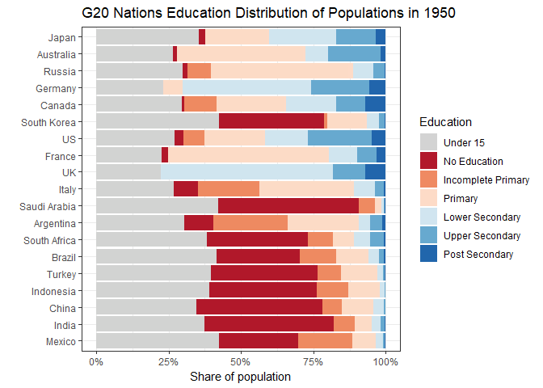

## Demographic data by educational levels

A few months ago the [**wcde**](https://guyabel.github.io/wcde/index.html) package was released on to CRAN, to enable R users to directly download past data and future projections of demographic data by education data provided in the Wittgenstein Centre Human Capital Data Explorer](http://dataexplorer.wittgensteincentre.org/wcde-v2/). In this post I animate past and projected future changes using the data on education compositions in selected countries obtained using the **wcde** package.

## Changes since 1950 in educational compositions

To look at past changes educational compositions we can use the `past_epop` data frame in the **wcde** package


```r
library(wcde)
head(past_epop)
```

```
##       name country_code year  age education  sex   epop
## 1 Bulgaria          100 1950 0--4  Under 15 Male  375.0
## 2  Myanmar          104 1950 0--4  Under 15 Male 1200.6
## 3  Burundi          108 1950 0--4  Under 15 Male  185.7
## 4  Belarus          112 1950 0--4  Under 15 Male  333.7
## 5 Cambodia          116 1950 0--4  Under 15 Male  372.6
## 6  Algeria           12 1950 0--4  Under 15 Male  715.1
```

To get only the G20 nations for plotting we can use the country codes package to look up the country code, given the names of each country

```r
library(tidyverse)
library(countrycode)

g20 <- c("Australia", "Canada", "Saudi Arabia", "United States",
         "India", "Russia", "South Africa", "Turkey",  
         "Argentina", "Brazil", "Mexico",
         "France", "Germany", "Italy", "United Kingdom",
         "China", "Indonesia", "Japan", "South Korea")

g20_codes <- countrycode(sourcevar = g20, origin = "country.name", destination = "iso3n")

g20_codes
```

```
##  [1]  36 124 682 840 356 643 710 792  32  76 484 250 276 380 826 156 360 392 410
```

In the code below we use the `g20_codes` object to filter to the appropriate countries. As the education levels in the education specific population data sets in the Wittgenstein Centre Human Capital data explorer vary by country and year we can use the `edu_group_sum()` function to ensure all countries have population totals by six education groups. Finally, the data are summed over age and sex to provide single population counts for each country, year and education group. 

```r
d0 <- past_epop %>%
  filter(country_code %in% g20_codes) %>%
  edu_group_sum(n = 6) %>%
  group_by(name, year, education) %>%
  summarise(epop = sum(epop))
d0
```

```
## # A tibble: 1,995 x 4
## # Groups:   name, year [285]
##    name    year education           epop
##    <fct>  <dbl> <fct>              <dbl>
##  1 Canada  1950 Under 15           4077 
##  2 Canada  1950 No Education        106.
##  3 Canada  1950 Incomplete Primary 1528.
##  4 Canada  1950 Primary            3296.
##  5 Canada  1950 Lower Secondary    2382.
##  6 Canada  1950 Upper Secondary    1368.
##  7 Canada  1950 Post Secondary      980.
##  8 Canada  1955 Under 15           5053.
##  9 Canada  1955 No Education        110.
## 10 Canada  1955 Incomplete Primary 1450 
## # ... with 1,985 more rows
```

To make visual comparisons easier in the plot we order the countries by the proportion of the population that are Under 15 in 1950;


```r
n <- d0 %>%
  filter(year == 2020) %>%
  group_by(name) %>%
  mutate(p_finish_secondary = sum(epop[6:7])/sum(epop)) %>%
  arrange(p_finish_secondary) %>%
  distinct(name) %>%
  pull(name) %>%
  as.character()
n
```

```
##  [1] "Mexico"                                              
##  [2] "India"                                               
##  [3] "China"                                               
##  [4] "Indonesia"                                           
##  [5] "Turkey"                                              
##  [6] "Brazil"                                              
##  [7] "South Africa"                                        
##  [8] "Argentina"                                           
##  [9] "Saudi Arabia"                                        
## [10] "Italy"                                               
## [11] "United Kingdom of Great Britain and Northern Ireland"
## [12] "France"                                              
## [13] "United States of America"                            
## [14] "Republic of Korea"                                   
## [15] "Canada"                                              
## [16] "Germany"                                             
## [17] "Russian Federation"                                  
## [18] "Australia"                                           
## [19] "Japan"
```

We update the `d0` data frame to take the ordering of the countries saved in object `n`. We also shorten the full name of the United Kingdom.


```r
d0 <- d0 %>%
  mutate(name = factor(name, levels = n)) %>%
  arrange(name) %>%
  mutate(name = countryname(sourcevar = name),
         name = fct_inorder(name))
d0
```

```
## # A tibble: 1,995 x 4
## # Groups:   name, year [285]
##    name    year education            epop
##    <fct>  <dbl> <fct>               <dbl>
##  1 Mexico  1950 Under 15           11893.
##  2 Mexico  1950 No Education        7632.
##  3 Mexico  1950 Incomplete Primary  5228.
##  4 Mexico  1950 Primary             2301.
##  5 Mexico  1950 Lower Secondary      690.
##  6 Mexico  1950 Upper Secondary      184 
##  7 Mexico  1950 Post Secondary        83 
##  8 Mexico  1955 Under 15           14544.
##  9 Mexico  1955 No Education        8005.
## 10 Mexico  1955 Incomplete Primary  5943 
## # ... with 1,985 more rows
```

The data is then ready to pass to ggplot2 and gganimate


```r
library(gganimate)
a <- ggplot(data = d0, 
       mapping = aes(x = epop, y = name, fill = fct_rev(education))) +
  geom_bar(position = "fill", stat = "identity") +
  scale_x_continuous(labels = scales::percent) +
  scale_fill_manual(values = wic_col6, name = "Education") +
  transition_time(time = year) +
  labs(x = "Share of population", y = "",
       title = 'G20 Nations Education Distribution of Populations in {round(frame_time)}') +
  theme_bw()

animate(a, start_pause = 10, end_pause = 20)
```

<!-- -->

## Future changes in educational compositions.
