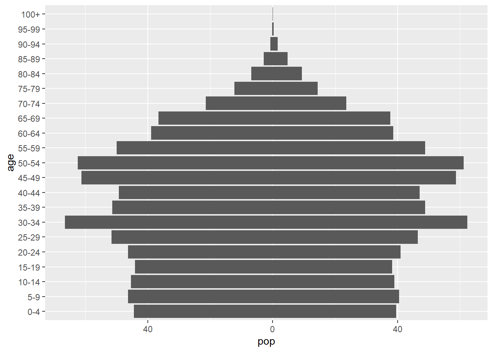

Over the last few years  I have been trying to take notes on different styles of population pyramids and reproducing them using ggplot. In this post I give an overview of my code in case anyone wishes to replicate similar plots. Below is a quick preview of the different styles of plots covered.



## Data

* [General pyramid data](#general-pyramid-data)
* [Specific pyramid data](#specific-pyramid-data)

For the examples below I use data from the UN on population age and sex structures provided in the [`wpp2019`](https://cran.r-project.org/web/packages/wpp2019/index.html) R package. The data cover all countries, so it should be fairly simple to edit the code to replicate plots for different countries. 

The `wpp2019` does not use a tidy data format, so a little data manipulation is required first to get a the population data in a single column, so that it will play nicely with ggplot.

```{r, message= FALSE, warning = FALSE}
library(tidyverse)
library(wpp2019)

# load population data objects in wpp2019
data(popF)
data(popM)

# create a tidy data frame
d <- popM %>%
  mutate(sex = "Male") %>%
  bind_rows(popF) %>%
  replace_na(list(sex = "Female")) %>%
  pivot_longer(cols = "1950":"2020", names_to = "year",
               values_to = "pop000", names_transform = list(year = as.integer))
d
```

#### General pyramid data

Before creating a pyramid I create some additional columns that make plotting much easier, these include

1. A `pop` variable that takes negative male values and positive female values. The new variable will enable the placement of male population figures on the left of the plot and females on the right. To my mind, this is the most important manipulation for creating population pyramids in `ggplot`, as it facilitates the use of a single geom making it far simpler to extend plotting code for facets or animations to compare populations over time or space. I use this variable in all the plots below.

2. Convert the age categories to a factor with levels based on the youngest to the oldest age groups. This is used in almost all the plots below that are based on `geom_col()`

3. Create a numeric column `age_mid` based on the mid point of the age group, useful when using `geom_step()` or `geom_path()`

4. Set male to the first level of a `sex` factor to ensure it plots on the right when using facets to plot and label the male and female sections of the population distribution.

```{r}
d <- d %>%
  mutate(pop_m = pop000/1e3,
         pop = ifelse(test = sex == "Male", yes = -pop_m, no = pop_m),
         age = fct_inorder(age), 
         age_min = as.numeric(age) * 5 - 5,
         sex = fct_rev(sex))
```

#### Specific pyramid data

There are two further variables that are useful when plotting some specific population pyramids: 

5. A `pop_min` variable that provides the lowest population for a given age group (in a given country and year). I use this for showing gender surpluses in population pyramids

6. A `pop_max` variable that provides the largest population for a given country and year. I use this for setting x-axis limits when facet plots are used to join together plots for each sex.  

```{r}
d <- d %>%
  group_by(age, year, country_code) %>%
  mutate(pop_min = ifelse(test = sex == "Male", yes = -min(pop_m), no = min(pop_m))) %>%
  group_by(year, country_code) %>%
  mutate(pop_max = ifelse(test = sex == "Male", yes = -max(pop_m), no = max(pop_m))) %>%
  ungroup()
d
```
## Basic pyramid

To begin with I will use data from China in 2020 to create a basis population pyramids;
```{r}
# initial
chn2020 <- d %>%
  filter(name == "China", 
         year == 2020)
chn2020
```

The most basic population pyramid, without distinguishing sexes (discussed later) can be produced with a few lines of code:

```{r}
ggplot(data = chn2020,
       mapping = aes(x = pop, y = age)) +
  geom_col() + 
  scale_x_continuous(labels = abs)
```

#### Many ages

The data above uses five-year age groups. When the number of age groups becomes excessive it is preferable to use a numeric variable for age. The `geom_col()` function can still be used with numeric variables, but the orientation of the columns must be explicitly set: 

```{r}
ggplot(data = chn2020, 
       mapping = aes(x = pop, y = age_min)) +
  geom_col(orientation = "y") + 
  scale_x_continuous(labels = abs)
```

Not the lowest columns stretch below age zero, as the lowest part of the column is plotted at the mid point of the difference the `age_min` values. The whole pyramid can be shifted up, so that the lowest columns lie on the x-axis by adding 2.5 (half of the size of each age group) to `age_min`

```{r}
ggplot(data = chn2020, 
       mapping = aes(x = pop, y = age_min + 2.5)) +
  geom_col(orientation = "y") + 
  scale_x_continuous(labels = abs)
```

#### Line outlines

Rather than plot a solid columns for each age group, `geom_path()` can be used to show the outline of pyramid. The `geom_path()` function uses the order of the observations in the data object, so care must be taken in preparing the data. The data used in the example below are already in age order. The `group` aesthetic must be used to ensure two lines (paths) are drawn separately for each sex, otherwise a trace line might appear that directly connects the observation from the highest age group with the lowest age group.

```{r}
ggplot(data = chn2020,
       mapping = aes(x = pop, y = age_min, group = sex)) +
  geom_path() +
  scale_x_continuous(labels = abs)
```

#### Step outline

An alternative method to visualize a outline of the pyramid is to use the `geom_step()` function. The function can also be useful to overlay silhouettes of previous pyramids, as shown below.

The `geom_step()` functions can be a little tricky to work with populuation pyramids. A couple of adjustments are required:

1. The x-axis must be set to the numeric ages (`age_min`) and the y-axis to the population values. The axis are then flipped using the `coord_flip()` function.

2. As with `geom_path()` the group aesthetic is required to distinguish different sets of steps for each sex

3. The labels for population values on the x-axis are set to positive values using `scale_y_continuous()` rather than `scale_x_continuous()` given the `y` aesthetic from the `ggplot()` function.


```{r}
ggplot(data = chn2020,
       mapping = aes(y = pop, x = age_min, group = sex)) +
  geom_step() +
  coord_flip() +
  scale_y_continuous(labels = abs)
```

## Axes

There are range of different axis styles that can be employed when creating population pyramids
 
#### Labels

Axis labels can be added using the `labs()` function. Later on in this post I will go into more detail on how to label the male and female sections of the plot.

```{r}
ggplot(data = chn2020, 
       mapping = aes(x = pop, y = age)) +
  geom_col() + 
  scale_x_continuous(labels = abs) +
  labs(x = "Population", y = "Age")
```

#### Breaks

If label space is of a premium the `every_other()` function in the `wcde` function can be used to provide reduced breaks on the x-axis. 

```{r}
library(wcde)
b <- every_other(levels(d$age))
b
```

There is an `n` argument in the `every_other()` function, with default `n = 2`, that can be altered if larger intervals are required. 

The labels in `b` can be passed to the plot code in the `scale_y_discrete()` function:

```{r}
ggplot(data = chn2020, 
       mapping = aes(x = pop, y = age)) +
  geom_col() + 
  scale_x_continuous(labels = abs) +
  scale_y_discrete(breaks = b)
```

When age is a continuous variable the `pretty_breaks()` function in the `scales` package can be used to control the number of age labels. It can also be used for the population axis:

```{r, message=FALSE, warning=FALSE}
library(scales)
ggplot(data = chn2020, 
       mapping = aes(x = pop, y = age_min + 2.5)) +
  geom_col(orientation = "y") + 
  scale_x_continuous(labels = abs, breaks = pretty_breaks(n = 8)) +
  scale_y_continuous(breaks = pretty_breaks(n = 10))
```

#### Second y-axis

Duplicate axis can be added with the `dup_axis()` function passed to the `sec.axis` argument in `scale_y_continuous()`. This necessitates the use of a continuous age variable: 

```{r}
ggplot(data = chn2020, 
       mapping = aes(x = pop, y = age_min + 2.5)) +
  geom_col(orientation = "y") + 
  scale_x_continuous(labels = abs) +
  scale_y_continuous(sec.axis = dup_axis())
```

I have not found an relatively simple way to add a secondary axis if discrete age groups are used rather than a continuous equivalent, as there is no `sec.axis` argument in `scale_y_discrete()`.

A secondary axis can be used to pass additional details to the plot such as the year of birth using the `trans` argument within the `sec_axis()` function:

```{r}
ggplot(data = chn2020, 
       mapping = aes(x = pop, y = age_min + 2.5)) +
  geom_col(orientation = "y") + 
  scale_x_continuous(labels = abs) +
  scale_y_continuous(sec.axis = sec_axis(trans = ~(2020 - . ), 
                     breaks = pretty_breaks(n = 5),
                     name = "Year of Birth"))
```


#### Middle x-axis

The x-axis can be moved to the middle of the pyramids, splitting the sex-specific population distributions using the `facet_share()` in the `ggpol` package. Setting the `scales = free_x` ensures the x-axis limits in the male (and female) facet cover positive (negative) values. 
 
```{r, message = FALSE, warning=FALSE}
library(ggpol)
ggplot(data = chn2020, 
       mapping = aes(x = pop, y = age)) +
  geom_col() +
  facet_share(facets = "sex", scales = "free_x") +
  scale_x_continuous(labels = abs)
```
I am not sure what the fix is for moving the age-axis label closer to the facet boundary.

## Highlighting Sex

The `facet_share()` function labels each sex specific population. This can be carried out in a number of other ways. 

#### Fill

The simplest method to identify the different sexes in ggplot is to use the `fill` aesthetic:
```{r}
ggplot(data = chn2020, 
       mapping = aes(x = pop, y = age, fill = sex)) +
  geom_col() + 
  scale_x_continuous(labels = abs)
```

#### Annotations

A second approach is to directly add labels onto the plot area using the `annotate()` function where

- The x coordinates can be set to `-Inf` for the male label and `Inf` for the female label,

- The y coordinates can be set to an appropriate high age value. If `age` is discrete the value will be the level of the corresponding one of the oldest age groups. 

- Justify the horizontal male and female labels with -1 and 1 respectively

- Add a space at the start and end of the male and female labels respectively

```{r}
ggplot(data = chn2020, 
       mapping = aes(x = pop, y = age)) +
  geom_col() + 
  scale_x_continuous(labels = abs) +
  annotate(geom = "text", x = -Inf, y = 21, label = " Male", hjust = 0) +
  annotate(geom = "text", x = Inf, y = 21, label = "Female ", hjust = 1) 
```

#### Facets

A third approach is to use the `facet_wrap()` function to plot each sex population distribution separately. As with `facet_share()` the `scales` argument needs to be set to ` "free_x"` 

```{r}
ggplot(data = chn2020, 
       mapping = aes(x = pop, y = age)) +
  geom_col() +
  facet_wrap(facets = "sex", scales = "free_x") +
  scale_x_continuous(labels = abs)
```

The facets can be joined together by 

1. Setting expand in `scale_x_continuous` to `c(0, 0)` to remove space between facet window and data
2. Setting `panel.spacing.x` in to zero in the `theme()` function to eleminate spaces between each facet window

When removing the space between the facets it is also useful to 

3. Add a `geom_blank()` to add back on the extra space on the outer edges of the plot taken away from using `expand` in `scale_x_continuous()`. The size of the `geom_blank()` is based on the biggest population group given in the `pop_max` column of the data

4. Add `geom_vline()` to clearly show the split between male and female distributions

```{r}
ggplot(data = chn2020, 
       mapping = aes(x = pop, y = age)) +
  geom_col() +
  facet_wrap(facets = "sex", scales = "free_x") +
  geom_vline(xintercept = 0, colour = "black") +
  geom_blank(mapping = aes(x = pop_max * 1.05)) +
  scale_x_continuous(labels = abs, expand = c(0, 0)) +
  theme(panel.spacing.x = unit(0, "pt"))
```

The facet labels can be moved below the plot by

1. Setting `strip.position = "bottom"` in the `facet_wrap()` function
2. Setting `strip.background = "transparent"` in `theme()`
3. Set the margins of strip text to zero in `theme()`

```{r}
ggplot(data = chn2020, 
       mapping = aes(x = pop, y = age)) +
  geom_col() +
  facet_wrap(facets = "sex", scales = "free_x",
             strip.position = "bottom") +
  geom_blank(mapping = aes(x = pop_max * 1.05)) +
  scale_x_continuous(labels = abs, expand = c(0, 0)) +
  theme(panel.spacing.x = unit(0, "pt"),
        strip.placement = "outside",
        strip.background = element_rect(fill = "transparent"),
        strip.text.x = element_text(margin = margin( b = 0, t = 0)))
```

## Sex comparisons

#### Horizontal pyramid

If intrest your intrest lies in see the differenes by sex then you might want to plot overlapping vertical columns as recommended by Bostock. In ggplot these plots can be created by setting `position = "identity"` in the `geom_col()` and using the `alpha` argument to make column fills semi-transparent.


```{r}

ggplot(data = chn2020, 
       mapping = aes(x = age, y = pop_m, fill = sex)) +
  geom_col(position = "identity", alpha = 0.5)
```


#### Highlight surplus

An alternative method to illustrate population sex surpluses by age group is to add extra shadings at the end of the column as used by [Kaj Tallungs](https://www.reddit.com/r/dataisbeautiful/comments/lmgy4t/oc_animated_demographic_pyramid_of_sweden_18602019/)

This can be achieved by plotting two pyramids by calling `geom_col()` twice. The first instances uses the original data. The second overlays the `pop_min ` column created at the top of this guide with a semi-transparent fill. 

```{r}
ggplot(data = chn2020, 
       mapping = aes(x = pop, y = age, fill = sex)) +
  geom_col() +
  geom_col(mapping = aes(x = pop_min), fill = "grey", alpha = 0.8) +
  scale_x_continuous(labels = abs) +
  labs(fill = "Surplus")
```


#### Symmetric sex axes

Creating male and female axis enables an easier comparison of the asymmetry between the sexes in the population structure. This can be achieved using either the `geom_blank()` and the `pop_max()` column as shown above or the `scale_x_symmetric()` from the `lemon` package.

To illustrate I use data for Qatar 2020 where sex imbalance is very dramatic:

```{r, message = FALSE, warning = FALSE}
library(lemon)
d %>%
  filter(name == "Qatar",
         year == 2020) %>%
  ggplot(mapping = aes(x = pop, y = age, fill = sex)) +
  geom_col() +
  scale_x_symmetric(labels = abs)
```


## Country comparisons

Using a variable that takes negative values for male and positive for females allows the ggplot code above to easily be adapted to handle multiple pyramids. 

```{r}
ci2020 <- d %>%
  filter(name %in% c("China", "India"),
         year == 2020)
```

#### Facets

```{r}
ggplot(data = ci2020, 
       mapping = aes(x = pop, y = age)) +
  facet_wrap(facets = "name") +
  geom_col() +
  scale_x_continuous(labels = abs)
```

It would be far more complicate to replicate a similar plot with geoms for each sex, as used in multiple stackoverflow solutions (here, here, here) 

#### Ovelay

An alternative method to compare pyramids is to overlay plots 
```{r}
ggplot(data = ci2020, 
       mapping = aes(x = pop, y = age, fill = name)) +
  geom_col(position = "identity", alpha = 0.6) +
  scale_x_continuous(labels = abs)
```

#### Outlines 

```{r}
ggplot(data = ci2020,
       mapping = aes(y = pop, x = age_min, colour = name,
                     group = interaction(sex, name))) +
  geom_step() +
  coord_flip() +
  scale_y_continuous(labels = abs)
```

#### Mixing

Economist mixes the two

```{r}
f <- c("India" = "transparent", "China" = "grey50") 

ggplot(data = ci2020, 
       mapping = aes(y = pop, x = age_min,
                     fill = name, colour = name,
                     group = interaction(sex, name))) +
  geom_col(mapping = aes(x = age_min + 2.5), 
           position = "identity", colour = "transparent", 
           width = 5) +
  geom_step() +
  coord_flip() +
  scale_fill_manual(values = f) +
  scale_y_continuous(labels = abs)
```

#### Dodge

A third alternative is to use a dodge layout of the columns in each age group. 

```{r}
ggplot(data = ci2020, 
       mapping = aes(x = pop, y = age, fill = name)) +
  geom_col(position = "dodge") +
  scale_x_continuous(labels = abs)
```


## Temporal comparisons

The code in the previous section can be adapted to compare multiple years rather than countries, by switching `name` with `year`. However, comparisons over many time periods using the plots above can become cumbersome. 


Adding shading for more than a few years can be difficult to view when some population age groups shrink but can work well for countries where age groups are continuously growing... ourworldindata

```{r}
d %>%
  filter(name == "Kenya",
         year %% 10 == 0) %>%
  arrange(rev(year)) %>%
  ggplot(mapping = aes(x = pop, y = age, fill = year)) +
  geom_col(position = "identity") +
  scale_x_continuous(labels = abs) +
  scale_fill_viridis_c(direction = -1) +
  labs(x = "Populaton", y = "Age", fill = "Year")
```

Animated plots can be produced using gganimate:
```{r}
d %>%
  filter(name == "Kenya") %>%
  ggplot(mapping = aes(x = pop, y = age, fill = year)) +
  geom_col(position = "identity") +
  scale_x_continuous(labels = abs) +
  labs(x = "Populaton", y = "Age", fill = "Year")
```


