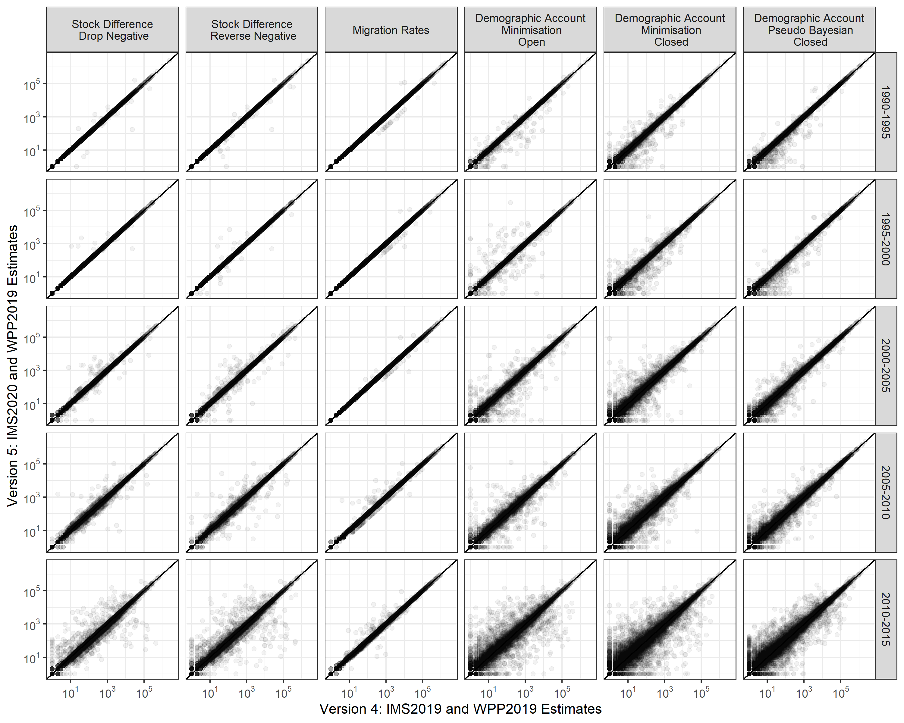

```{r setup, include=FALSE}
knitr::opts_chunk$set(echo = TRUE)
```

:::: {style="display:inline-block; vertical-align:top"}
::: {.altmetric-embed data-doi="10.1038/s41597-019-0089-3" data-badge-type="medium-donut" data-hide-no-mentions="true" data-badge-popover="right"}
:::
::::

:::: {style="display: inline-block"}
::: {.__dimensions_badge_embed__ data-doi="10.1038/s41597-019-0089-3" data-hide-zero-citations="true"}
:::
::::

## Updates

Since the paper was published, I have produced seven updates to reflect

-   The latest United Nations demographic data released in WPP2019, WPP2022 and WPP2024 (July 19, 2019, 28 October, 2022 and 30 October and 2024)
-   The latest United Nations migrant stock data released in IMS2019 and IMS2020 (October 23, 2019, February 1, 2021 and March 25, 2015)
-   Corrections for Serbia, Montenegro, Sudan and South Sudan in earlier periods (August 3, 2020)

See the table of contents to jump to a short discussion on each update. The different versions of estimates are all available on [Figshare](https://figshare.com/articles/dataset/Bilateral_international_migration_flow_estimates_for_200_countries_1990-1995_to_2010-2015_/7731233)

<a id="WPP2019"></a>

## Version 2: Update for WPP2019

This paper came out a day before the United Nations Population Division updated its [World Population Prospects](https://population.un.org/wpp/) (WPP). As all the estimates were based on WPP2017, our claim that the estimates were based on the most up-to-date input data was only true for around 24 hours.

To keep the estimates a bit more current, I have added a new version based on WPP2019 to the [Figshare collection](https://figshare.com/collections/Bilateral_international_migration_flow_estimates_for_200_countries/4470464). Below is a quick summary of the changes in the updated estimates to those in the paper.

#### Comparison to past estimates based on WPP2017 and WPP2019

The plot below shows the relationship between the bilateral flow estimates based on WPP2017 and WPP2019 from each period and estimation method.


For the stock differencing methods, there are no changes in the estimates. They do not rely on WPP data. The migration rates approach uses the total absolute net migration data from WPP. All bilateral flows from WPP2019 are slightly higher than their WPP2017 counterparts, though barely noticeable in the plot above. The demographic accounting methods use the birth, death and population estimates from the WPP. In each method, there are some sizable differences in the flows generated by updated revisions to the WPP demographic data, in particular for those based on the closed demographic accounting approach.

This difference results in revisions to the overall totals of migration flows. Below is an animation of the changes to [Figure 2](https://www.nature.com/articles/s41597-019-0089-3#Fig2) in the paper


This plot makes it easier to see the changes in the migration rate estimation method. I was surprised that the changes in the estimates occurred in all periods, not just the most recent period (2010-2015). To investigate, I looked at the changes in the WPP data.

#### Which countries are most affected?

The countries where the most significant changes in the bilateral estimates occurred (from the closed demographic accounting methods) can be detected by looking at the revisions in net migration between WPP2017 and WPP2019. Net migration is the best measure to track their changes as it correlates perfectly with the net migration in the WPP. The residual of the input data (births, deaths and population) for the estimates is based on the demographic accounting methods. Below are the changes in the complete time series of net migration in nine countries where the largest absolute differences (in any period) between the two WPP versions occur.


At first, I was a bit surprised by the scale of the changes. In some periods, the revisions to net migration are greater than a million. I dug deeper into net migration in previous WPP revisions to find that similar revisions are not unusual. Below are the revisions of absolute net migration between past WPP versions that exceed one million (back to WPP2000, the earliest WPP data I can get my hands on).

```{r, message=FALSE, warning=FALSE, include=FALSE}
# , message=FALSE, warning=FALSE, include=FALSE,  echo = FALSE}
load("sd.Rdata")
library(DT)
library(tidyverse)
d1 <- d0 %>%
  ungroup() %>%
  mutate_if(is.numeric, ~ round(. , digits = 2)) %>%
  rename("WPP" = 1,
         "Period" = 2,
         "Country Name" = 3,
         "Net Migration (millions)" = 4,
         "Net Migration, Previous WPP" = 5,
         "Revision (Absolute)" = 6) %>%
  datatable(options = list(
  initComplete = JS(
    "function(settings, json) {",
    "$('body').css({'font-family': 'Calibri'});",
    "}"
  ))) %>% 
  formatRound(columns=3:6, digits=2)

```

```{r, echo=FALSE}
widgetframe::frameWidget(d1, height = "100%")
```

#### Impact on validation exercise

The impact of the revision in WPP data on the validation exercise in the paper is minimal. Below is an update of [Figure 4](https://www.nature.com/articles/s41597-019-0089-3#Fig4) in the paper.


The correlations change by a few hundredths of a decimal. These small changes, despite what is shown in the first plot above, are due to the limited amount of reported migration flow statistics (at the global level) to carry out our validation exercise. In the 45 countries that we used (based on the United Nations Population Division [collection](https://www.un.org/en/development/desa/population/migration/data/empirical2/migrationflows.asp)), the revisions in the WPP data were relatively minor; hence, there were only small changes in their estimates and the correlations with the reported data.

<a id="IMS2019"></a>

## Version 3: Update for IMS2019

Another update in the input data came out a few weeks back - this time the UN [International Migrant Stock](https://www.un.org/en/development/desa/population/migration/data/estimates2/estimates19.asp) (IMS) data. I have added another set of flow estimates based on the IMS2019 and WPP2019 to the [Figshare collection](https://figshare.com/collections/Bilateral_international_migration_flow_estimates_for_200_countries/4470464) (the original flow estimates in the paper were based on IMS2017). I do not expect there will be a need to update the estimates again until at least 2021.

Below are a few plots that give visual summaries of the changes in the updated estimates compared to those in the paper and from the last update.

#### Comparison to past estimates

The plot below shows the relationship between the bilateral flow estimates based on IMS2017 and WPP2017 (as in the paper) and IMS2019 - WPP2019 (this update) from each period and estimation method.


In all methods (columns), there are changes in some of the estimates, which tend to be larger in more recent periods (lower rows) and estimation methods based on demographic accounting (columns to the right). These patterns are likely due to larger revisions in the most recent stock data and the use of updated demographic data in the demographic accounting methods - not required in the stock differencing approaches.

The revisions to the overall totals of migration flows, shown in [Figure 2](https://www.nature.com/articles/s41597-019-0089-3#Fig2) in the paper, are animated below, transitioning from 1) the estimates in the paper to 2) the first update of the estimates from changes in the demographic data to 3) the most recent update for changes in the stock data.


The 2010-2015 estimates suggest that total global flows remained at similar levels to 2005-2010. Earlier versions of the estimates had suggested a decline. As a result, the crude global migration rate fell by only a small margin for most estimation methods during 2010-2015, except for pseudo-Bayesian estimates of flows, where the rate increased slightly.

#### Which countries are most affected?

The largest changes in the bilateral flow estimates can be partially detected by inspecting the revisions in migrant stock data between IMS2017 and IMS2019. In the stock differencing methods, these changes are directly related to the change in the estimated flow sizes between the bilateral country pair. In the demographic accounting approaches, the impact of the revision is less direct on the estimated flows, as each method allows for return and onward migration to match changes in migrant stock data. Below is a scatter plot of the changes in the IMS data by continent.


There are a few features to note. First, and unsurprisingly, the largest revisions occur in the most recent data (2015). Second, the biggest changes are in North American data sources. Below is a table of the bilateral pairs where the revision to the migrant stocks is greater than 100,000. Third, in some areas, there are noticeable patterns to the changes - the diagonal lines parallel to the $y=x$ line - which I guess is related to updates in the data used to imputation missing bilateral stocks.

```{r, message=FALSE, warning=FALSE, include=FALSE}
# , message=FALSE, warning=FALSE, include=FALSE,  echo = FALSE}
load("sd2.Rdata")
d3 <- d2 %>%
  ungroup() %>%
  mutate_if(is.numeric, ~ round(. , digits = 2)) %>%
  rename("Year" = 1,
         "Birthplace" = 2,
         "Residence" = 3,
         "IMS2017" = 4,
         "IMS2019" = 5,
         "Revision (Absolute)" = 6) %>%
  datatable(options = list(
  initComplete = JS(
    "function(settings, json) {",
    "$('body').css({'font-family': 'Calibri'});",
    "}"
  ))) %>% 
  formatRound(columns=4:6, digits=0)

```

```{r, echo=FALSE}
widgetframe::frameWidget(d3, height = "100%")
```

#### Impact on validation exercise

The impact of the revision in stock data on the validation exercise from the paper is slightly larger than the previous update, but still not very dramatic. Below is an animated version of [Figure 4](https://www.nature.com/articles/s41597-019-0089-3#Fig4) in the paper, showing the correlations between the flow estimates and reported data for various migration measures, for the original estimates and subsequent updates based on new WPP and IMS data.


As with the first update, the small changes in the correlations, despite some large revisions in the migrant stock data, are due to the limited amount of reported migration flow statistics (at the global level) to carry out our validation exercise.

<a id="SCGSUD"></a>

## Version 4: Correct for Serbia, Montenegro, Sudan and South Sudan before 2005

In the original paper and updates described above, both Serbia and Montenegro, Sudan, and South Sudan were treated as separate countries throughout the 1990 to 2015 period. This was not a great choice. Although the UN provide separate demographic and migrant stock data for each of the four countries back to 1990, the notes in the migrant stock spreadsheet (numbers 4 and 24) point out that the foreign-born data for Sudan and Serbia before 2005 cover South Sudan and Montenegro, respectively. In South Sudan and Montenegro before 2005, no data was provided for the foreign-born populations.

The differences in geographic coverage of Sudan and Serbia in the migrant stock data impact the flow estimates based on the differences in stocks. For example, the demographic accounting-based methods calibrate changes in foreign-born stocks (from zero in 1990 to zero in 1995, for example) in South Sudan and Montenegro with a non-zero net migration over the period. This was resolved in the background by some parts of the IPF code running until their default iteration limit rather than until convergence, where convergence was not feasible. I picked up on this when adding new warning messages in the `ffs_demo()` function of the [migest](https://cran.r-project.org/web/packages/migest/index.html) package which should now alert users for non-convergence.

To rectify this problem, I have created a new version of the estimates that treat Serbia, Montenegro, Sudan, and South Sudan as single countries before 2010-2015. This reduces the number of countries in the earlier periods of the data to 198; there are still 200 countries, and the estimates are the same as in the previous update. I use the SCG and SUD country codes for Serbia and Montenegro and Sudan before 2010-2015, and the four separate country codes during 2010-2015 and after (SRB, MNE, SDN, SSD as in previous versions).

I have added a few plots below to give some summaries of the changes in the updated estimates to those in the paper and from the last update.

#### Comparison to past estimates

The plot below shows the relationship between the bilateral flow estimates based on the last update based on IMS2019 and WPP2019 and the newer estimates with the correction for the four countries.

<!-- In all periods the estimates for 2005-2010 and 2010-2015 remain unchanged, hence all points are on the diagonal line. In earlier periods there are a small number of bilateral estimates from the rates and demographic accounting methods. For the demographic accounting methods this is due to the combining of data for the four countries allowing the IPF routines to fully converge. The biggest changes occur in estimates between African countries from the correction to Sudanese and South Sudanese born populations. For the rates method all estimates are revised from the change in the global migration flow total, obtained from the sum of net migration flows.  -->

<!--  -->

#### Impact on validation exercise

The impact of the correction for the four countries on the validation exercise is very minor. Below is an animated version of [Figure 4](https://www.nature.com/articles/s41597-019-0089-3#Fig4) in the paper, showing the correlations between the flow estimates and reported data for various migration measures, for the original estimates, the previous updates based on new WPP and IMS data and the new estimates with a correction for the four countries before 2010-2015.


<a id="IMS2020"></a>

## Version 5: Update for IMS2020

The new UN [International Migrant Stock](https://www.un.org/development/desa/pd/content/international-migrant-stock) (IMS) data came out a few weeks back. I have added another set of flow estimates based on the IMS2020 and WPP2019 to the [Figshare collection](https://figshare.com/collections/Bilateral_international_migration_flow_estimates_for_200_countries/4470464) (the original flow estimates in the paper were based on IMS2017). As the IMS2020 contain bilateral stocks for 2020, it was possible to generate a first set of flow estimates for the 2015-2020 period, shown at the end of the animation below for estimates based on one of the methods covered in the paper:

```{=html}
<style>
video {
  /* override other styles to make responsive */
  width: 100%    !important;
  height: auto   !important;
  max-height: 720px
}
</style>
```

<video loop="loop" width="720" height="720" poster="v5-flow.png" controls>

<source src="v5-flow.mp4" type="video/mp4" />

</video>

Below are a few plots to give some visual summaries of the changes in the estimates compared to previous versions.

#### Comparison to past estimates

<!-- The plot below shows the relationship between the bilateral flow estimates based on IMS2019 and WPP2019 (previous update) and IMS2019 - WPP2019 (this update) from each period and estimation method. -->

<!--  -->

<!-- As with the previous updates, all methods (columns) see some changes in the flows estimates, which tend to be larger in more recent periods (lower rows) and estimation methods based on demographic accounting (columns to the right).  -->

The plot of the total migration flows, shown in [Figure 2](https://www.nature.com/articles/s41597-019-0089-3#Fig2) in the paper, is updated below with the new estimates, including the new values for 2015-2020.


The estimates for the new 2015-2020 period show continued slow growth of total flows based on the pseudo-Bayesian method estimates. The other demographic accounting methods also see a slight increase in the estimated total flows during 2015-2020 from 2010-2015. A noticeable decline in the total flows during 2015-2020 was estimated using the rates approach and incline from the stock differencing methods. I suspect all the estimates for 2015-2020 will see some significant changes from future revisions of the IMS data, as data drips in from the 2020 round of censuses that will alter the stocks and demographics used as input data to estimate flows in the most recent periods.

The evolution of the estimates' changes from different revisions in the input data can be seen below, transitioning from 1) the estimates in the paper to 2) the first update (version 2) of the estimates from changes in the demographic data to 3) the second update for changes in the stock data (version 4) to the most recent update (version 5, the same as the plot above).


#### Impact on validation exercise

The impact of the revision in stock data on the paper's validation exercise is still relatively minor. Below is an update of the animated version of [Figure 4](https://www.nature.com/articles/s41597-019-0089-3#Fig4) in the paper, showing the correlations between the flow estimates and reported data for various migration measures, for the original estimates and subsequent updates based on new WPP and IMS data.


As with the other updates, the small changes in the correlations, despite some large revisions in the migrant stock data, are due to the limited number of reported migration flow statistics (at the global level) required to carry out our validation exercise. The estimates during 2015-2020 do not influence due to the lack of corresponding reported flow data in the UN collection.

<a id="WPP2022"></a>

## Version 6: Update for WPP2022

The new UN [World Population Prospects](https://population.un.org/wpp/) (WPP) data came out a few months back. I have added another set of flow estimates based on the IMS2020 and WPP2022 to the [Figshare collection](https://figshare.com/collections/Bilateral_international_migration_flow_estimates_for_200_countries/4470464) (the original flow estimates in the paper were based on IMS2017 and WPP2017). The WPP2022 contain data on births and deaths in more countries (primarily small countries and territories) than previous versions, allowing estimates of migration flows between 229 countries, compared to the 200 in previous versions.

Our paper on sex-specific flow estimates was published in [Scientific Data](https://www.nature.com/articles/s41597-022-01271-z) at the start of this year. The updated flow estimates based on the WPP2022 data, which expanded to 229 countries, are in a separate [Figshare collection](https://figshare.com/collections/Bilateral_international_migration_flow_estimates_by_sex/5800838).

The WPP data are now annual, running between 1 January and 31 December for each measure. This differs from the migrant stock data, which are aligned at 1 July in five-year intervals. Consequently, I had to do some extra coding to interpolate the WPP2022 demographic data to five-year summary measures that match the intervals in the migrant stock data and obtain the five-year flow estimates.

Below are a few plots that give visual summaries of the new estimates and their changes relative to previous versions, alongside some discussion.

#### Comparison to past estimates

The plot of the total migration flows, shown in [Figure 2](https://www.nature.com/articles/s41597-019-0089-3#Fig2) in the paper, is updated below with the new estimates, including the 30-odd extra new countries included in the estimates from the expanded data availability in WPP2022 input data.


The evolution of the estimates' changes from different revisions in the input data can be seen below, transitioning from 1) the estimates in the paper to 2) the first update (version 2) of the estimates from changes in the demographic data to 3) the second and third updates for changes in the stock data (version 4 and 5) to the 5) most recent update (version 6, the same as the plot above).


The latest rise in the level of the estimates from the demographic accounting and migration rates methods is a result of two big changes: 1) the expanded set of countries and 2) some dramatic revisions in the birth, death and population data in WPP2022 compared to WPP2019. The changes in the demographic data and their impact on the estimated migration flows can be best viewed by inspecting the biggest changes in net migration between WPP2019 and WPP2022.

Some of the revisions in net migration are much larger than the [previous changes](#WPP2019) between WPP2017 and WPP2019. Pakistan, where the largest revision occurs, has a net migration loss in WPP2022 of over 7 million in the last two five-year periods. In WPP2019, in the same periods, the net migration loss was just over 1 million. I am not sure if the revised WPP2022 values are plausible. In any case, these revisions have big impacts on the bilateral flow estimates, especially those based on the closed demographic accounting methods, which are implicitly constrained to match the WPP net migration.

#### Impact on validation exercise

The impact of the revision in WPP data on the validation exercises is more pronounced than in any other updates so far. Below is an updated animated version of [Figure 4](https://www.nature.com/articles/s41597-019-0089-3#Fig4) in the paper, showing the correlations between the flow estimates and reported data for various migration measures, for the original estimates and subsequent updates based on new WPP and IMS data.

 There biggest changes are the drops in the correlations for the estimates based on demographic accounting approaches, especially in the immigration and emigration rate measures. The general ordering of preferences between the estimates from different methods, based on the highest levels of correlation, remains unchanged.

<a id="WPP2024"></a>

## Version 7: Update for WPP2024

The latest UN [World Population Prospects](https://population.un.org/wpp/) (WPP) data was published during the summer. I have updated the flow estimates in the [Figshare collection](https://figshare.com/collections/Bilateral_international_migration_flow_estimates_for_200_countries/4470464) based on the IMS2020 and WPP2024 (the original flow estimates in the paper were based on IMS2017 and WPP2017). One additional country/territory in this edition of the flow estimates was formed by combining the Guernsey and Jersey data in WPP2024 to match the Channel Islands data in the migrant stock data (IMS2020). I have also updated the [sex-specific](https://www.nature.com/articles/s41597-022-01271-z) flow estimates for WPP2024 in the separate [Figshare collection](https://figshare.com/collections/Bilateral_international_migration_flow_estimates_by_sex/5800838).

Below are some plots and discussion on the new estimates and their changes relative to previous versions, starting with an animated chord diagram of the updated region-to-region flow estimates over time:

```{=html}
<style>
video {
  /* override other styles to make responsive */
  width: 100%    !important;
  height: auto   !important;
  max-height: 720px
}
</style>
```

<video loop="loop" width="720" height="720" poster="v7-flow.png" controls>

<source src="v7-flow.mp4" type="video/mp4" />

</video>

#### Comparison to past estimates

The plot of the total migration flows, shown in [Figure 2](https://www.nature.com/articles/s41597-019-0089-3#Fig2) in the paper, is updated below with the new estimates.


The evolution of the estimates' changes from different revisions in the input data can be seen below, transitioning from 1) the estimates in the paper to 2) the first update (version 2) of the estimates from changes in the demographic data to 3) the second and third updates for changes in the stock data (version 4 and 5) to the 5) updates based on WPP2022 and WPP2024 (version 7, the same as the plot above).


The further rise in the level of the estimates from the demographic accounting and migration rates methods resulted in some dramatic revisions in the birth, death and population data in WPP2024 compared to WPP2022. As in the previous update, the changes in the demographic data and their impact on the estimated migration flows can be best viewed by inspecting the biggest changes in net migration between WPP2019 and WPP2022, which are implied constraints in the demographic accounting flow estimation procedures.

```{=html}
<style>
.carousel-indicators {
  bottom:-3%
}
.carousel-indicators > li,
.carousel-indicators > li.active{
    width: 40%;
    height: 2%;
    border-radius: 0;
    border: solid 1px grey;
    background: transparent;
    text-indent: 0;
    text-align: center;
}
.carousel-indicators > li.active {
    background: #4caf50;
}
</style>

<div id="carousel_img" class="carousel slide">
  <ol class="carousel-indicators">
    <li data-target="#carousel_img" data-slide-to="0" class="active">Annual Data</li>
    <li data-target="#carousel_img" data-slide-to="1">Five-Year Equivalent</li>
  </ol>
  <div class="carousel-inner">
    <div class="carousel-item active">
      
    </div>
    <div class="carousel-item">
      
    </div>
  </div>
</div>
<br>
```

As with the last update, the net migration revisions are larger than the [previous changes](#WPP2019) between WPP2017 and WPP2019. Bangladesh, where the largest revision occurs, has a net migration loss in WPP2024 of approximately 5 million in the last two five-year periods (2010-2015 and 2015-2020). In WPP2022, in the same periods, the net migration loss was just over 1 million. The UN DESA provide no information on such big revisions, and it remains to be seen if they will coincide with rises in Bangladeshi-born populations abroad in forthcoming migrant stock data. Large revisions are noticeable in other major migration-sending and receiving countries between 1990 and 2020. The revisions in the demographic data have sizable impacts on the bilateral flow estimates, especially those based on the closed demographic accounting methods, which are implicitly constrained to match the WPP net migration.

#### Impact on validation exercise

Below is an update of the animated version of [Figure 4](https://www.nature.com/articles/s41597-019-0089-3#Fig4) in the paper, showing the correlations between the flow estimates and reported data for various migration measures for the original estimates and subsequent updates based on new WPP and IMS data.

 The biggest changes, compared with the previous update, are the correlations between the net migration data and the net migration estimates based on stock differencing approaches. The general ordering of preferences between the estimates from different methods, based on the highest levels of correlation, remains unchanged.

<a id="IMS2024"></a>

## Version 8: Update for IMS2024

The new UN [International Migrant Stock](https://www.un.org/development/desa/pd/content/international-migrant-stock) (IMS) data came out earlier this year. I have added another set of flow estimates based on the IMS2024 and WPP2024 to the [Figshare collection](https://figshare.com/collections/Bilateral_international_migration_flow_estimates_for_200_countries/4470464) (the original flow estimates in the paper were based on IMS2017 and WPP2017). Although the IMS2024 contain bilateral stocks for 2024, I did not generate flow estimates for the 2020-2024 period, to avoid having a mix of estimates on four-year and five-year migration intervals over the entire period. The animation below is an update of some those above, showing the estimated global migration flow patterns between 1990 and 2020 for one of the methods covered in the paper:

```{=html}
<style>
video {
  /* override other styles to make responsive */
  width: 100%    !important;
  height: auto   !important;
  max-height: 720px
}
</style>
```

<video loop="loop" width="720" height="720" poster="v8-flow.png" controls>

<source src="v8-flow.mp4" type="video/mp4" />

</video>

The new estimates include migration flows for Taiwan, which were previously combined with those for Mainland China. Sint Maarten and Curaçao now have flow estimates for the entire period, whereas previously, there was no migrant stock data available in these countries to enable flow estimation before 2005 and 2010, respectively.

Below are a few plots to give some visual summaries of the changes in the estimates compared to previous versions.

#### Comparison to past estimates

The plot of the total migration flows, shown in [Figure 2](https://www.nature.com/articles/s41597-019-0089-3#Fig2) in the paper, is updated below with the new estimates.


The evolution of the estimates' changes from different revisions in the input data can be seen below, transitioning from 1) the estimates in the paper to 2) the first update (version 2) of the estimates from changes in the demographic data to 3) the second and third updates for changes in the stock data (version 4 and 5) to the 5) updates based on WPP2022 and WPP2024 (version 7, the same as the plot above), finishing with 6) the most recent update (version 8, the same as the plot above).


#### Which countries are most affected?

The largest changes in the bilateral flow estimates can be partially detected by inspecting the revisions in migrant stock data between IMS2020 and IMS2024. In the stock differencing methods, these changes are directly related to the change in the estimated flow sizes between the bilateral country pair. In the demographic accounting approaches, the impact of the revision on the estimated flows is less direct, as each method allows for return and onward migration to match changes in migrant stock data. Below is a scatter plot of the changes in the IMS data by continent.


There are a couple of features to note. First, there are fewer observations in IMS2024 compared to IMS2020, shown by the points on the horizontal axis in Africa, Asia and Europe (these missing values are set to zero in the flow estimation). Second, the biggest revisions for migrant stock destination data are in Saudi Arabia, USA, Germany, Kazakhstan and Thailand. Below is a table of the bilateral pairs where the revision to the migrant stocks is greater than 100,000. 

```{r, message=FALSE, warning=FALSE, include=FALSE}
# , message=FALSE, warning=FALSE, include=FALSE,  echo = FALSE}
load("sd4.Rdata")
d4 <- d3 %>%
  ungroup() %>%
  mutate_if(is.numeric, ~ round(. , digits = 2)) %>%
  rename("Year" = 1,
         "Birthplace" = 2,
         "Residence" = 3,
         "IMS2024" = 4,
         "IMS2020" = 5,
         "Revision (Absolute)" = 6) %>%
  datatable(options = list(
  initComplete = JS(
    "function(settings, json) {",
    "$('body').css({'font-family': 'Calibri'});",
    "}"
  ))) %>% 
  formatRound(columns=4:6, digits=0)

```

```{r, echo=FALSE}
widgetframe::frameWidget(d4, height = "100%")
```

#### Impact on validation exercise

The impact of the revision in stock data on the validation exercise from the paper is slightly larger than the previous update, but still not very dramatic. Below is an animated version of [Figure 4](https://www.nature.com/articles/s41597-019-0089-3#Fig4) in the paper, showing the correlations between the flow estimates and reported data for various migration measures, for the original estimates and subsequent updates based on new WPP and IMS data.


As with the previous updates, the small changes in the correlations, despite some large revisions in the migrant stock data, are due to the limited amount of reported migration flow statistics (at the global level) to carry out our validation exercise.