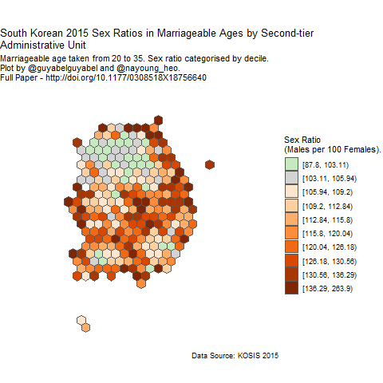

+++
title = "Subnational gender balances in South Korea"
date = "2018-02-06"

# Authors. Comma separated list, e.g. `["Bob Smith", "David Jones"]`.
authors = ["Guy J. Abel", "Nayoung Heo"]

# Publication type.
# Legend:
# 0 = Uncategorized
# 1 = Conference proceedings
# 2 = Journal
# 3 = Work in progress
# 4 = Technical report
# 5 = Book
# 6 = Book chapter
# publication_types = ["2"]

# Publication name and optional abbreviated version.
publication = "In *Environment and Planning A: Economy and Space*, 50 (5), 941-944."
publication_short = ""

# Abstract and optional shortened version.
abstract = "Within one generation, the South Korean economy developed from one of the poorest countries in the world during the 1950s to a developed, high-income country by the end of the 1990s. During the latter part of this period, South Korea (hereafter called Korea) experienced rapid demographic change characterized by a steep decline in fertility levels and abnormally high sex ratios at birth. Unlike other East and South-East Asian countries that underwent similar economic and demographic changes, Korea has witnessed a steady decline in the sex ratios at birth since the end of 1990s through 2000s. In this paper, we visualize the current spatial distribution of population born during the peak years of sex ratios at birth."

# Featured image thumbnail (optional)
image_preview = ""

# Is this a selected publication? (true/false)
selected = false

# Projects (optional).
#   Associate this publication with one or more of your projects.
#   Simply enter the filename (excluding '.md') of your project file in `content/project/`.
# projects = ["example-external-project"]

# Links (optional).
doi = "doi/10.1177/0308518X18756640"
url_pdf = "http://journals.sagepub.com/doi/pdf/10.1177/0308518X18756640"
url_preprint = ""
url_code = ""
url_dataset = ""
url_project = ""
url_slides = ""
url_video = ""
url_poster = ""
url_source = ""

# Custom links (optional).
#   Uncomment line below to enable. For multiple links, use the form `[{...}, {...}, {...}]`.
# url_custom = [{name = "", url = ""}]

# Does the content use math formatting?
math = true

# Does the content use source code highlighting?
highlight = true

# Featured image
# Place your image in the `static/img/` folder and reference its filename below, e.g. `image = "example.jpg"`.
[header]
image = "headers/plot_srm2.png"
caption = "Sex Ratios in Marital Ages 2015"

+++

   

  

   

## Further Notes

An animated version of the plot in the paper I made when playing around with [`gganimate`](https://github.com/thomasp85/gganimate)

